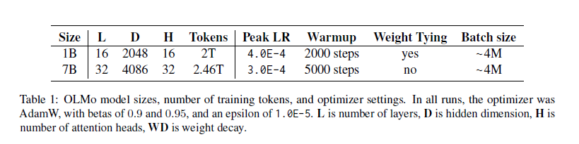
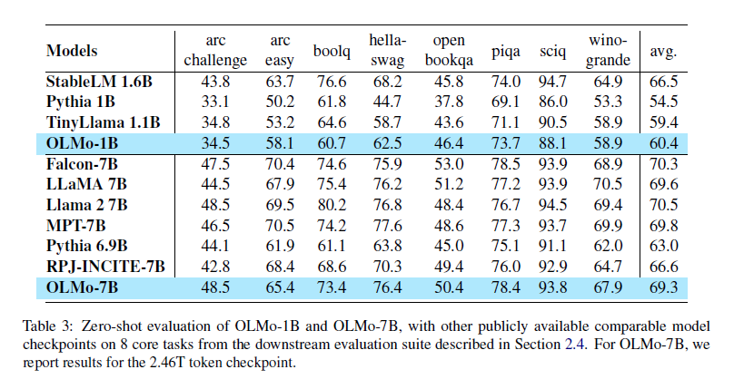

# OLMo: Accelerating the Science of Language Models

## 1. Introduction
   - **What is OLMo?**
      - OLMo (Open Language Model) is a language model developed by the Allen Institute for Artificial Intelligence, aiming to promote open research in natural language processing (NLP).
      - Unlike proprietary models, OLMo provides unrestricted access to all facets of the model, including **weights, training data, code, and evaluation tools**, making it a true "open-source" model for the research community.
   - **Why OLMo?**
      - Proprietary language models, while advanced, restrict researchers' access to critical components, limiting study into potential biases, ethical risks, and areas for improvement. By making all model components open, OLMo encourages scientific understanding and transparent assessment of language models' strengths and weaknesses.

## 2. Background and Motivation
   - **The Closed Nature of LMs**:
      - Advanced language models like GPT-4 and Bard are typically proprietary, available only through limited interfaces. This proprietary approach makes it difficult for researchers to analyze their internal workings, understand potential biases, or improve upon their functionalities.
   - **OLMo’s Objective**:
      - To break down barriers in NLP research, OLMo offers an **end-to-end open framework**, encompassing every part of the model's development process, from data collection to evaluation tools. By doing so, it enables a more transparent and accountable study of language models, fostering innovation in the field.
   - **Real-World Impact**:
      - With access to OLMo, the research community can conduct detailed investigations into issues such as bias detection, robustness, ethical considerations, and model behavior analysis, which are often difficult to achieve with closed models.

## 3. OLMo Framework
   - **Components of the OLMo Framework**:
     - **Model Variants**:
       - OLMo offers two versions: a **1B parameter model** and a **7B parameter model**. Both are large enough to be competitive with existing LMs but also manageable for researchers to analyze and deploy.
     - **Training Data - Dolma**:
       - The "Dolma" dataset is a carefully curated, **multi-source corpus** containing trillions of tokens from Common Crawl, GitHub, Reddit, Semantic Scholar, Project Gutenberg, and Wikipedia. This diversity helps OLMo achieve a broad understanding of various language contexts.
       - **Data Curation**:
         - Dolma data was processed through extensive filtering, deduplication, and quality checks to ensure it provides a rich, representative dataset for pretraining.
     - **Evaluation Tools**:
       - OLMo includes **Catwalk** for task evaluations across various NLP tasks and **Paloma** for perplexity-based language evaluation, providing a robust framework for testing model performance.

   - **Key Architectural Innovations**:
     - OLMo introduces architectural features to enhance model efficiency and performance:
       - **Rotary Positional Embeddings (RoPE)**: Improves how the model understands token positions, enhancing its comprehension of language structure.
       - **SwiGLU Activation Function**: Replaces the traditional ReLU activation to reduce training instability and improve convergence.
     - *Table*: Key specifications of the OLMo model versions.

## 4. Training and Adaptation
   - **Training Setup**:
     - OLMo was trained using **LUMI supercomputer** and **MosaicML clusters**, utilizing mixed-precision training to boost efficiency and reduce computational demands.
     - **Distributed Training**: Leveraged the ZeRO optimizer and PyTorch’s FSDP framework, reducing memory use across multiple GPUs and enhancing the training throughput.
   - **Adaptation for Practical Use**:
     - OLMo can be adapted to various tasks through **fine-tuning**, enabling it to serve as a general-purpose assistant, with optimizations in safety, usability, and alignment to human preferences.
     - **Safety and Usability Enhancements**:
       - After pretraining, OLMo was fine-tuned to enhance its ability to handle user instructions safely, ensuring its responses are aligned with ethical and safe usage practices.

## 5. Evaluation
   - **Zero-Shot Task Performance**:
     - OLMo achieved competitive results on eight core NLP tasks without any task-specific training, proving its robustness in zero-shot settings.
     - These tasks include **ARC Easy and Challenge, BoolQ, HellaSwag, OpenBookQA, PIQA, SciQ,** and **Winogrande**.
   - **Comparative Analysis**:
     - OLMo was benchmarked against other models like LLaMA, Falcon, and MosaicML’s MPT, showcasing performance comparable or superior on various tasks.
     - **Controlled Testing with Intermediate Checkpoints**:
       - OLMo provides intermediate checkpoints during training, allowing researchers to track the model’s progress across multiple training steps and compare against other public checkpoints.
     - *Table*: OLMo’s zero-shot task performance compared to other language models.

## 6. Contributions and Artifacts
   - **What’s Released?**
     - In addition to the model weights, OLMo releases:
       - **Full Pretraining Corpus (Dolma)**: Available for further research and analysis.
       - **Training Code and Adaptation Tools**: Code for training and finetuning, enabling users to replicate and adapt the model.
       - **Evaluation Framework**: The Catwalk and Paloma tools for a range of NLP evaluations.
   - **Licensing**:
     - OLMo is distributed under the **Apache 2.0 license**, encouraging researchers and developers to use and expand upon the model with minimal restrictions.

## 7. Conclusion and Future Directions
   - **Research Impact**:
     - OLMo is designed to advance scientific understanding of LMs, empowering the community to study aspects like data influences, model structure effects, and ethical considerations in depth.
   - **Future Plans**:
     - OLMo’s framework will be extended to additional **languages**, **modalities** (e.g., multimodal models), **safety measures**, and **robustness improvements** to make it more versatile and applicable to diverse tasks.
     - **Goal for Innovation**:
       - By promoting open access to powerful LMs, OLMo aims to inspire novel applications, robust AI designs, and ethical research practices.

## 8. Ethical Considerations
   - **Transparency vs. Risk**:
     - While open access provides transparency, there are risks of misuse. However, the OLMo team believes that openness is essential for enabling responsible research and ethical advancements in AI.
   - **Efforts to Mitigate Risks**:
     - Extensive data filtering and safety alignment in training; continual monitoring and community feedback on potential misuse.
   - **Environmental Considerations**:
     - OLMo’s distributed training setup emphasizes efficiency and reduced environmental impact, encouraging responsible AI development practices.

### References
   - Include references on language model development, open-source models, training frameworks, and relevant research.

